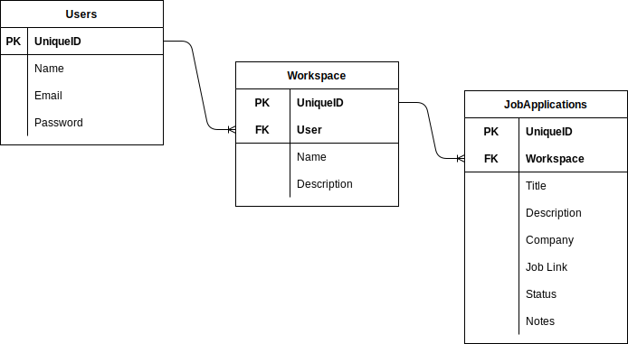

# Job Application Tracker - API

An app that uses React JS for the front end and Ruby on Rails API for the backend

---

## Version
 - React v3.1.2
 - Rails v7.0.4

## Setup
```
$ bundle
$ rails db:setup
$ rails s
```

## Test
```
$ rspec
```

# ERD


# Gems Used
- dotenv-rails
- devise
- devise-jwt
- rack-cors
- jsonapi-serializer
- rspec-rails
- capybara

# Features Implemented
- [x] Token-based authentication using devise and devise-jwt
- [x] API only configuration
- [x] RSpec Tests
- [x] Serialize JSON for output
- [ ] Reports

# Projects Link
- Board: [Visit the link to see the progress of this project](https://github.com/users/jocogum10/projects/3/views/1).
- Front End: [Visit the link to see the progress of the Front End used](https://github.com/jocogum10/job-application-tracker-fe)